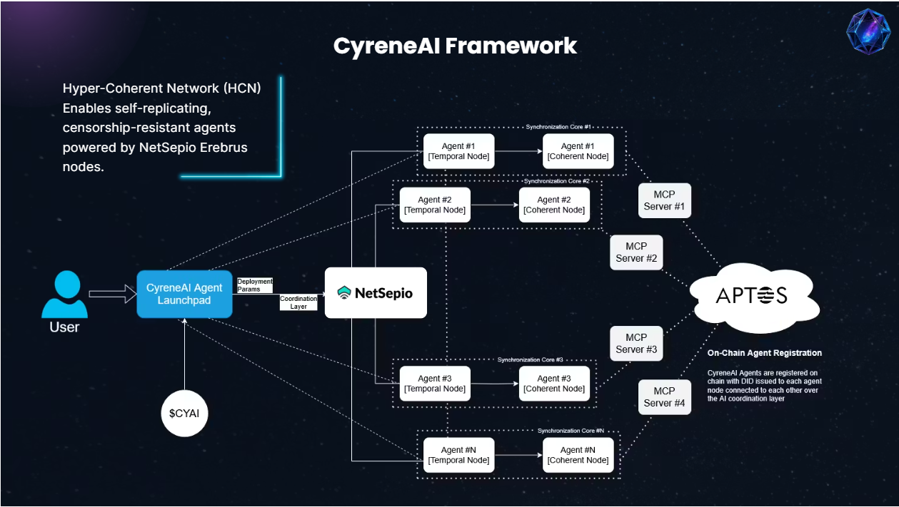

# CyreneAI — Distributed Digital System Framework

CyreneAI enables users to create and operate persistent, autonomous digital systems by using a global network of contributor-run devices. It removes the need for centralized cloud services and reduces hosting costs by over 70%.

---

##  NetSepio Node Infrastructure

CyreneAI is powered by **NetSepio's Erebrus Node Network**, a permissionless compute and bandwidth layer contributed by individual users.

### What It Does

- Users install lightweight software on their devices to share **compute and bandwidth**.
- These nodes become part of the **CyreneAI execution mesh**, enabling smart systems to run across distributed resources.
- This infrastructure replaces traditional hosting and enables **cost-effective, censorship-resistant deployments**.

### 🖥 How to Run a Node

Open your terminal and run the following command:

```bash
sudo bash <(curl -s https://raw.githubusercontent.com/NetSepio/erebrus/node_installer/install-node.sh)
```
### 🛠️ Setup Instructions

1. Follow the on-screen prompts to install dependencies.  
2. You’ll be guided through a configuration process.  
3. Set parameters like machine name, location, and contribution limits.  
4. Once configured, your machine will start participating in the **Erebrus compute network**.


### CyreneAI Framework

The **CyreneAI Framework** enables users to deploy and manage AI agent across the Erebrus node network.

### Core Capabilities

- Deploys logic to distributed nodes instead of cloud servers.
- Uses a protocol called **Hyper-Coherent Network (HCN)** for:
  - System coordination  
  - Context sharing  
  - Self-replication (no single point of failure)



### Key Benefits

- **Reduces hosting cost by 70%**
- **No dependency on centralized providers**
- **Persistent and private execution**

---

### Launchpad & Mobile App

To simplify deployment for non-technical users and organizations, we’ve built the following tools:

### CyreneAI Launchpad

- A web-based tool for launching systems with just a few clicks.
- Includes templates for automation, monitoring, and real-time operations.
- Anyone can deploy without writing code.

### CyreneAI Mobile App

- Enables interaction with your deployed systems from any device.
- Currently available:
  - **Android** (Live) (https://play.google.com/store/apps/details?id=com.erebrus.app)
  - **iOS** (via TestFlight) (https://testflight.apple.com/join/BvdARC75)

---

##  Smart Contract Overview

### NetSepio V1 Contract (Aptos)

- **Network**: Testnet  
- **Module**: `netsepio_v1`  
- **Address**: `0x6299daec2e0c0e0f8c0f824bd91290286af7d709375b4c9593858d49a2227a40`

### Features

- NFT minting
- Node registration & management
- Uptime checkpoints
- Admin/operator permissions

### Key Functions

- `delegate_mint` – Operator-based minting
- `register_node` – Add new node with metadata
- `create_checkpoint` – Log uptime events
- `update_node_status` – Mark node active/offline
- `deactivate_node`, `grant_role`, `revoke_role`

---

### Error Codes

| Code | Description                 |
|------|-----------------------------|
| 0    | Signer not admin            |
| 1    | NFT supply limit exceeded   |
| 2    | Signer not operator         |
| 3    | User mint limit exceeded    |
| 7    | Node not found              |
| 8    | Node not active             |
| 9    | Unauthorized access         |

---

##  Testing

Smart contract includes full coverage for:

- Module setup  
- NFT logic  
- Node registration and status updates  
- Operator permissions  
- Error handling

---

##  Demos

- **Pitch Deck**: [CyreneAI Overview](https://pitch.com/v/cyreneai-aptos-pitch-the-future-of-ai-agents-r9sis5)  
- **Node Deployment Demo**: [Watch here](https://youtu.be/79nz7q6DedE)  
- **Launchpad Walkthrough**: [See it in action](https://youtu.be/GTdvp1zh97s)  
- **Mobile App Preview**: [Short demo](https://youtube.com/shorts/L6DS-fskakw?feature=share)

---

##  Contact

- Website: [https://cyreneai.com](https://cyreneai.com)  


---

## 📄 License

MIT License
